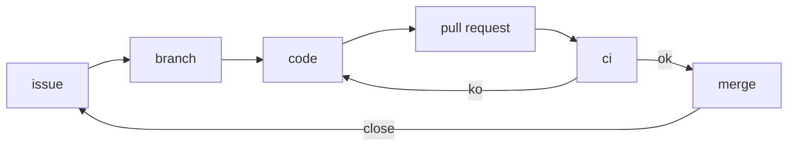

---

# Github basics

----

## Goals

  - Create a github project
  - Basic github project quality
  
## Tools

  - python
  - github
  
---

# Preparation

  - register on github
  - fork https://github.com/ioggstream/test-driven-development-101 and repo
   presentation

----

## Create an ssh key for github

```bash
ssh-keygen -o -a 100 -t ed25519 -f /tmp/id_deleteme; # man ssh-keygen  
ls -la /tmp/id_deleteme*
```

Now clone a git repo using the new key

```bash
export GIT_SSH_COMMAND='ssh -i /tmp/id_deleteme'
git clone git@github.com:caldav4j/caldav4j
```

---

# Create a GH project

When you create a project you need to provide QA metadata

  - README & LICENSE information
  - Issues & PR template to properly address contributions
  - Project layout
  
----

[This project](https://github.com/ioggstream/test-driven-development-101)
stores issues and PR templates in [.github](.github).

Here you can find

```bash
tree ../.github
```

- an [issue template](https://github.com/ioggstream/test-driven-development-101/blob/master/.github/ISSUE_TEMPLATE/custom.md)
- a [pull_request_template.md](https://github.com/ioggstream/test-driven-development-101/blob/master/.github/pull_request_template.md)

Further info on github templates are [here](https://docs.github.com/en/github/building-a-strong-community/using-templates-to-encourage-useful-issues-and-pull-requests)

Exercise:

- create an issue in this project
- clone this project
- create a PR adding your name to the CONTRIBUTORS file.
  
----

Always use this workflow when working on git



----


Now follow to [01-github-02-actions.md]

