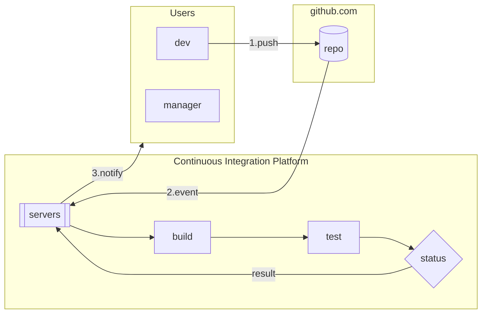

# Github actions


---

## Goals

  - Search and use github actions to apply quality checks to repositories
  - Write github actions
  
## Agenda

- What are Github Actions
- Adding an Action to an existing repository
- Action Marketplace
- Using actions from marketplace
- Publishing actions

---

# Github Actions

Github Actions allow to execute a set of commands on our repository

Actions are triggered by Github events (eg. push, PR, issue changes)

Contain build context information and the set of commands to be executed

You can check logs and eventually produce artifacts.


----

written in javascript (faster, less customizable) or docker

A simple action looks like 

```yaml
name: Build and test a java package on every push
on:
  push:
    branches: [ "*" ]
jobs:
  build:
    steps:
      # Checks-out your repository under $GITHUB_WORKSPACE, so your job can access it
      - uses: actions/checkout@v2

      # Runs a set of commands using the runners shell
      - name: Run a command
        run: |
          mvn test
```
----

## Github actions showcase

Present GH actions.

---

# Action in Practice

In this practice we will:
 
 - create a gh project starting from a template
 - add a Github Action that allow us to 
   provide some quality checks on our code

---- 

# Create a gh project from a template

  - Go to https://github/ioggstream/python-api-test
  - Click on "Use this template" to create a project based on this one
  - Check your new project
  - Check the content of the `.github`

----

# Add a github action

Once you have created the new project, you want to use a github action to 
ensure code quality - eg validate yaml syntax.

We will add [this yaml file](https://github.com/ioggstream/python-api-test/blob/master/.github/workflows/yamllint.yml)
to your repo [.github/workflows] directory, thus triggering the action.

Finally we will see the running workflow.

----

## Add a github action

The first thing to do is to:

  - create an Issue in your project where you "expect the presence of a
   validator for yaml files"; the issue should reflect the issue template
    we defined 

Then you can add the action: 

  - Click on "Action" -> "New workflow" -> "Setup a workflow yourself" 
  - Search for yamllint in the right pane
    and select the karancode/yamllint-github-action
  - paste the yamllint step in the action code or replace the editor
    content with the action below
  - commit to a branch referencing the issue id (eg. `1-add-yamllint`)
  - create a pull request (this should reflect the template too)

----

The action code is here

```yaml
# This is a basic workflow to help you get started with Actions
name: yamllint

# Controls when the action will run. Triggers the workflow on push or pull request
# events but only for the master branch
on:
  push:
    branches: [ master ]
  pull_request:
    branches: [ master ]

# A workflow run is made up of one or more jobs that can run sequentially or in parallel
jobs:
  # This workflow contains a single job called "build"
  build:
    runs-on: ubuntu-latest
    steps:
      # Checks-out your repository under $GITHUB_WORKSPACE, so your job can access it
      - uses: actions/checkout@v2

      - name: Yamllint Github Action
        uses: karancode/yamllint-github-action@v2.0.0
        with:
          # File or Directory to do yamllint on
          yamllint_file_or_dir: openapi
```

----

## Show the pipeline result

You should now see the pipeline result, like in [this example](https://github.com/ioggstream/python-api-test/runs/1037583851?check_suite_focus=true)

In your repository pipeline you can see all the logs - which are hidden for
 other people's eyes.
 
Now we have a broken build :) The next task is to make it work.

In the meanwhile, merge the PR!

----

## Fixing the pipeline status

Exercise: fix the pipeline modifying the validation rules

Read the [yamllint configuration instruction](https://yamllint.readthedocs.io/en/stable/configuration.html)

Hint: 

- add the  `.yamllint` file to the repository.
- always create a pull request and check the pipeline result

---

# Publishing actions [TODO]

Write and publish your actions via *code*

Documentation and version are required

