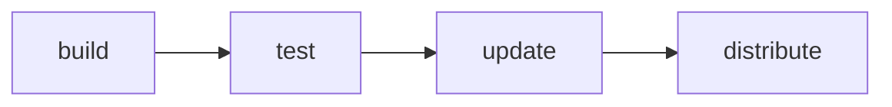
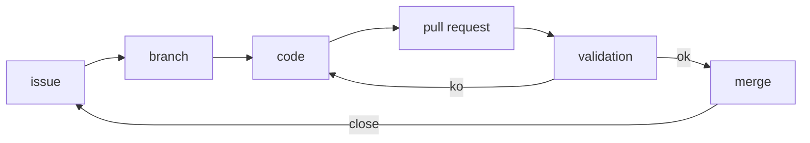
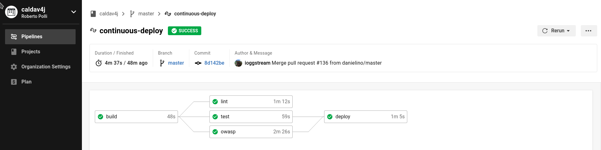
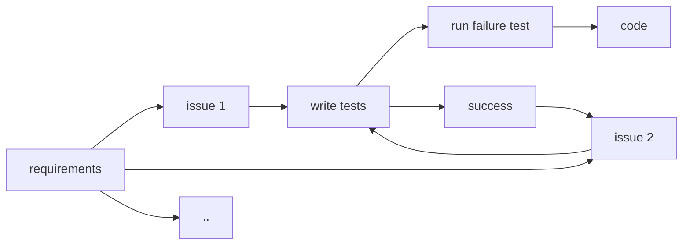

# Test Driven Development 101

---

## Goal

  - Design and implement a REST API using OpenAPI
  - Learn the basics of Test Driven Development
  - Create a Continuous Integration pipeline using cloud tools
  - Test every development phase and replace mocks with containerized components

----

## Prerequisites

  - git, see [git-101](https://github.com/ioggstream/python-course/blob/master/git-101)
  - docker, docker-compose
  - java and/or python development
  - maven
  
## Forewords

In this course we will present some theoretical introduction to 
software testing
and various tools - both software and online platforms - that are useful for
 ensuring software quality.

This includes docker containers, github & co.

Audience assessment.

---

# Software development lifecycle

There are 4 basic phases of the life of a software, and those depends on the software model.
We have even some differences between opensource and proprietary software.

Proprietary sw is built in a static environment, with a static distribution (release) with local and private repositories.

Opensource instead lives in a dynamic environment with quick and early releases, many dependencies and comes with a large and distributed user base.

Traditionally, after the user requirements are gathered, SDL includes the following phases

- build
- test
- update
- distribute

----

When using agile methodologies, user requirements can be summarized in task
or issues.

Automation technologies allow to continuously iterate the above steps
using the below workflow.

----

## Build

Building software is not just assembling a bunch of code, 
but is like building a home: select bricks, prepare the ground, put the roof...

The building steps can be:

- resolve: setup the build environment, checking and refreshing dependencies, ...
- package: assemble the software and run the QA checks (static analysis, unit tests, ..)
- install: once the sw is validated, it's installed in a validation environment and undergo further QA 
- deploy: at this point it can be deployed (in a production environment, on a public repository, ...)

This is true for every single package/software we are writing!

----
## Build goals

The goals of this process is to:

- version all your builds and dependencies
- create reproducible builds
- describe the package or application deployments and requirements (databases, infrastructure, configuration, ..)
- standardise the building steps

Currently all those steps were named:
- integration pipeline: if they are about the package or install phase
- delivery pipeline: if they reach the deployment and final environment (both a production environment or a public repository)

----

An example pipeline for the [caldav4j] project

----

## Tools

To ease this tasks there are many tools. The Java world traditional tool is `maven`
which covers all the steps we presented above (and many more). 

Maven splits the SDL in ~20 possible phases and allows us to trigger action for each phase,
including versioning and snapshotting the package.

In this course we will not use maven, but we expect you used it at least once.

Tools like maven give you control over the SDL and enforce a common workflow for all the developers of a project.

----

## Tools

While maven is tied to a specific language, in the recent years more tools have emerged: some to replace maven (eg. gradle, ...) others to integrate its functionalities in a more general environment.

The install phase which includes integration tests usually needed to spin up other machine or deploy packages on a testing environment, and drive all thos tasks from a java configuration file is very difficult.

To support more languages and strip off the maven configuration files
those steps, newer tools emerged. The first one was jenkins;
then other both in an on-premise environment or in cloud come out, eg. like gitlab-ci, circle-ci and github-actions.

----

## Tools

Maven projects use one single fine: the Project Object Model defining everything.

Newer and more diverse environment working with different languages may use different files instead, eg:

- maven, distutils or other packaging tool for the actual assembly of the
 project (pom.xml, pyproject.toml, package.json, Makefile, ...)
- one or more CI configuration file 
  (eg. circleci.yaml, travis.yml, jenkins-job.xml, ..) where each yaml file
  can run  one or more different jobs (eg. linting, static analysis, compile,
  document generation,..)

----

## Tools

In this course we will show  two project management tool:
 `tox` for python, `maven` for java.
 
Maven accomplishes its goals via different plugins (eg. junit, sonarqube).

Tox can be used to script out and invoke python programs for each SDL phase,
eg:

- poetry for dependency management
- pytest for running tests
- setuptools for assembling and distributing a package

---

# Test

Does the software:

  - produce the expected output?

  - behave in a secure way?

  - respect non-functional requirements?
 

----

## Ensuring software quality

Old development model were based on long cycles where
problems were discovered too late.

Technological improvements allowed to shorten development phases
and lowered the QA costs.

This give rise to continuous integration (CI):
 the practice of merging all developers' working copies to a 
 shared mainline several times a day.

To successfully merge working copies in an efficient way,
 we need a strategy to continuously test 
 that the changes won't break the product.

----

## Ensuring software quality

In the early 2000, the idea of Test-driven development (TDD) start to spread.

TDD advocates  the repetition of a very short development cycle:

  - requirements are turned into very specific test cases,
  - then the code is improved so that the tests pass.

This strategy ensures that every change meet the quality requirements,
and does not introduce regressions.

----

## Ensuring software quality

Adopting TDD requires basic automation skill, otherwise continuously testing changes
will be too costly.

This automation allows introducing metrics and scores, and puts incentives in creating
minimal changes so that the merging work will be more simple.

---

# Tests

There are 3 kinds of tests:
- Unit
- Integration
- Functional

----
## Unit 

- test each functionality of the code
- useful on tricky code (eg. regexp, algorithms, ..)
- may use mock objects (DB, other servers, ...)
- private methods shouldn't be tested (unless they should)

Beware of mocking complex objects! Use Integration tests instead.

----

## Integration

- individual software modules are tested as a group (eg. DB requests are tested with a real database to stress the underlying driver code, ...)
- may use real servers (eg. via containers)
- test feedback helps improving the design
- ensures library upgrades won't break/slowdown your code

When apps heavily use embedded components (database driver, application server functionalities, Context Dependency Injection, ..) you should stress that code too

----

## Functional

- test user requirements
- in a realistic environment
- includes performance and stresstest
- mimic user actions
- ignore the code logic

To mimic user actions you can use tools like Selenium

----

## Test environment

Integration and functional tests may require:

- packaging the application
- setup the deploy environment
- the actual deploy
- teardown and cleanup of all resources

Technologies like Kubernetes and Docker - on premises or SaaS - greatly simplify
all this kind of setup and allow to document with code and test the deployment process.

----

## Smoke testing

In complex environments we can use this technique to avoid spinning up a complete setup unless the principal parts are fine.

- a collection of written tests performed prior to being accepted for further testing
- touches all area of the software without going to indeep
- test if the software is so broken that detailed testing is unnecessary

