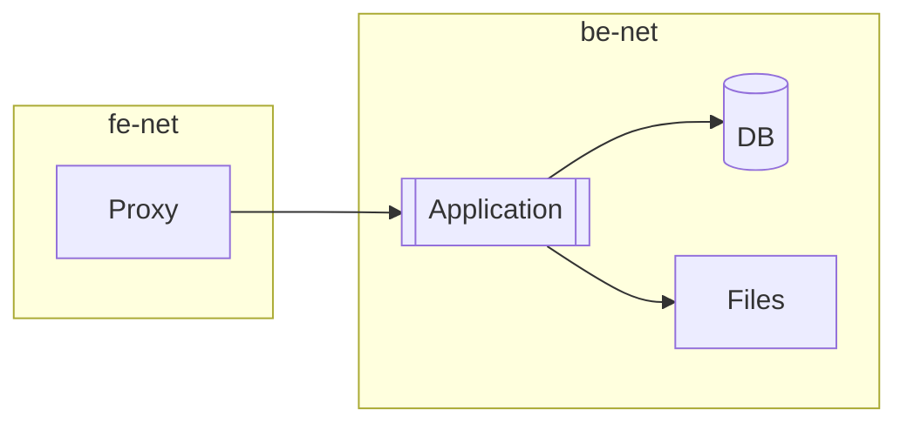
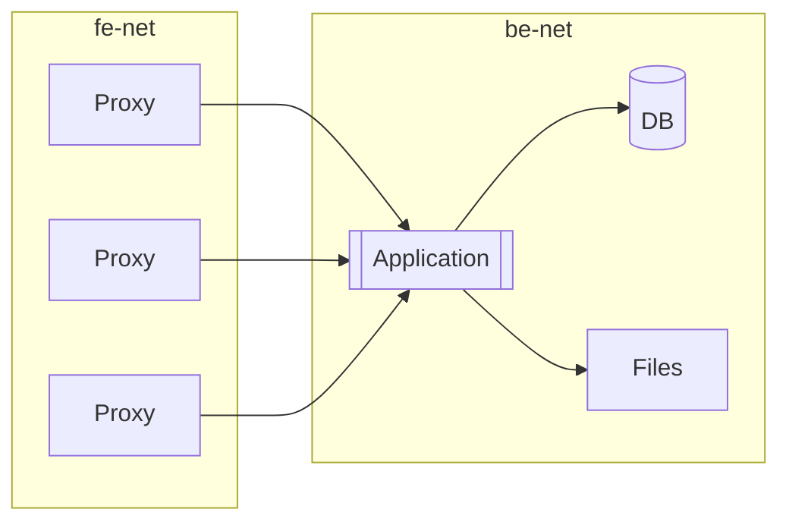

# Test Driven Development 101


```python
cd ex-01
```
---


## Goal

  - Where to test
  - docker
  - Static analysis & linting

---

# Where to test

The costs of setting up a test environment derive from:

  - setup doc is clumsy or stale
  - target environment is hard to setup
  - devs lack of system knowledge
  - lack of governance
  - multiple target environments
  
And sparing those costs leads to:


Similar memes could say *It works/worked with mocks/in test/yesterday*

----

A track record for tests helps reducing issues and protects developers and
 the company from liability.
 
Lack of tests is a *technical debt*, which comes with *interests
*. Companies like Google introduced procedures which take into account
 technical debts, monetize it and splits its cost between the responsible
  teams; this is an incentive to work with quality.

Use tools to reduce the test setup costs, ensure its quality and simplify
 complex cases like matrix testing.

---

## Old-style test environment

A traditional shared test environment required:

  - provisioning physical or virtual machines
  - virtual storages
  - network setup, firewalls, routes, ...
  - authorize access to the test environment, VPN setup, ...
  - data persistency issues

----

A local environment once required:

  - creating greedy VM on your machine, already stressed with the IDE
   & productivity tools
  - setting up a bridged or vlan network
  - usually, learn how to manage a DBMS



---

## Container reduce test setup costs


 
----

Using container we can simulate in a cheap environment various flavor of
 linux machines (eg. Ubuntu, RedHat, Debian, ...).
 
 - lightweight setup (one process per target environment)
 - use pre-packaged software images
 - testable environment setup

Another solution can rely on IaaS infrastructures, provided that the
 infrastructure layout has been defined via some tool like Terraform or
  Ansible.
  
---

## Docker quickstart

The docker command simulates a separate linux machine.

The following command creates a new linux container that has its own
filesystem and ip address.

```bash
# the --rm flag removes the container at exit
docker run --rm -i busybox  ip address
```

Exercise:

- using `man docker` or the online documentation, explain the meanings of the
 flags we have passed to `docker` in the above command.


----

Run the following command in the terminal [terminal](/terminals/1) to
 enter a new container with a shell
 
```bash
docker run --rm -t -i busybox
```

Exercise:

- list the running processes with `ps -ef`, note that by default
  the busybox image ran a shell as the first process
- use `ip -4 -o a` to show the container ip address
- use `hostname` to show the container hostname
- `exit` the container and ensure via `docker ps -a` that it has been
 correctly removed

 
----

### Pre-built images

You can download and run a pre-built image of an operating system 
in the terminal [terminal](/terminals/1) via

```bash
docker run --rm -ti ubuntu:20.04
```

To customize an image (eg. installing software) you have to:

1. write the instruction into a `Dockerfile`

```python
%load Dockerfile
```

2. in a [terminal](/terminals/1) run the following commands

```bash
# Create the new image
docker build -t deleteme-python-ubuntu .
# Execute the new image
docker run --rm -ti deleteme-python-ubuntu
```
----

There are pre-built images with pre-installed servers.

Let's run a mysql instance in background

```bash
# Run mysql on port 3306 of the local machine,
#  and pass an argument via an environment variable `-e`
docker run --name mysql-server --rm -d -p 3306:3306 -eMYSQL_RANDOM_ROOT_PASSWORD=true mysql
```

Exercise:

- explain the argument passed in the docker command line
- use `docker ps` to show all running containers
- use `docker logs mysql-server` to show the autogenerated password
- use `mysql -h localhost -uroot -p` to login to the server; supply the
 password you got from the logs.
- issue some simple SQL commands like

```sql
SELECT  1 + 1;
SHOW DATABASES;
// shutdown the mysql server with
SHUTDOWN;
```


---

## Infrastructure as code with Docker

The `docker-compose` tool is an executable that orchestrates on our
laptop the creation of multiple containers.

To setup an infrastructure like this one


we can write a docker-compose.yaml file that sets up the above infrastructure
using containers.

```load docker-compose.yml
```

----

A compose file is made of different sections:

```yaml
version: "3.3"
# Optional parts declaring networks and volumes
volumes:
  filestore:    
networks:
  fe:
  be:
...
```
----

Discuss the services...

```yaml
# Sections declaring services
services:
  proxy:
    image: nginx
    ...
  api:
    image: python:3.8-alpine
    ...
    command: [python, -mhttp.server]
  db:
    image: mysql
    environment:
      MYSQL_ROOT_PASSWORD: secret
```

----

Now spin the above infrastructure up!

```bash
docker-compose up -d
# and check if everything is fine with
docker-compose ps
```

From a [terminal](/terminals/1) enter on the `api` container 

```bash
docker exec -ti ex-01_api_1 bash
# then ping the other containers
ping -t1 db
ping -t1 proxy
```

----


The `--scale` option can spin multiple containers of a type
```bash
# Run 
docker-compose up -d --scale proxy=3
``` 

thus creating this setup


